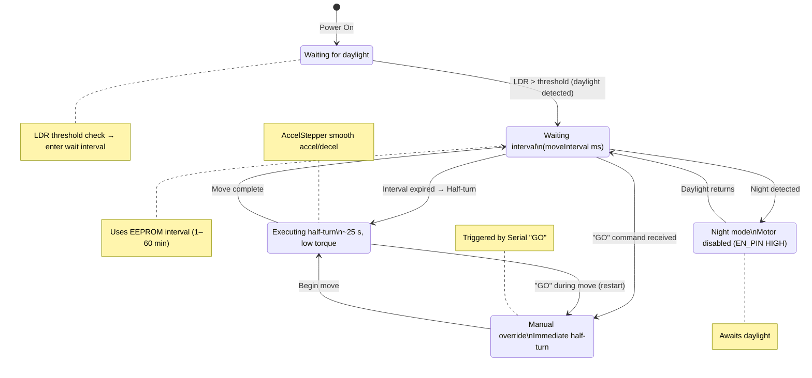
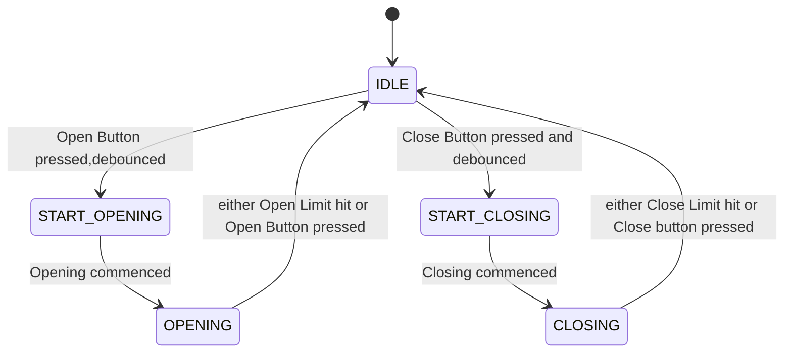
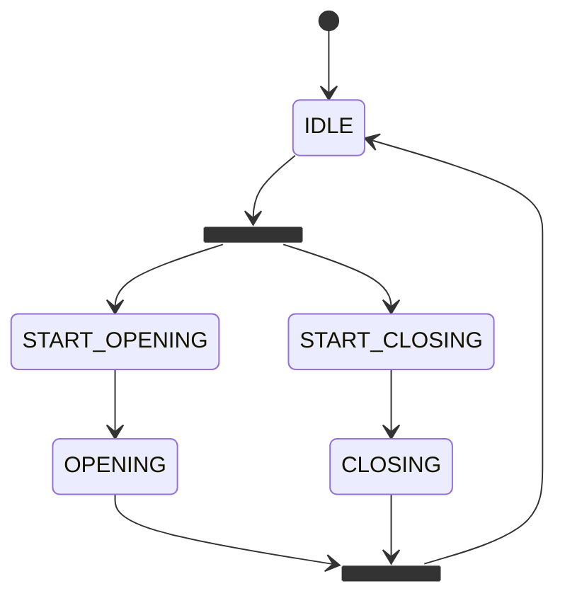

# John's projects

## State machine for clapper

```mermaid
%%===========================================================
%% File: clapper_fsm.mmd
%% Title: Clapper Stepper Motor FSM (RV8824 + LDR)
%% Compatible with GitHub Mermaid (GTFM)
%%===========================================================

stateDiagram-v2
    [*] --> STATE_IDLE : Power On

    STATE_IDLE : Waiting for daylight
    STATE_IDLE --> STATE_WAIT_INTERVAL : LDR > threshold (daylight detected)

    STATE_WAIT_INTERVAL : Waiting interval\n(moveInterval ms)
    STATE_WAIT_INTERVAL --> STATE_SLEEP : Night detected
    STATE_WAIT_INTERVAL --> STATE_MOVE : Interval expired → Half-turn
    STATE_WAIT_INTERVAL --> STATE_OVERRIDE : "GO" command received

    STATE_MOVE : Executing half-turn\n~25 s, low torque
    STATE_MOVE --> STATE_WAIT_INTERVAL : Move complete
    STATE_MOVE --> STATE_OVERRIDE : "GO" during move (restart)

    STATE_SLEEP : Night mode\nMotor disabled (EN_PIN HIGH)
    STATE_SLEEP --> STATE_WAIT_INTERVAL : Daylight returns

    STATE_OVERRIDE : Manual override\nImmediate half-turn
    STATE_OVERRIDE --> STATE_MOVE : Begin move

    %% Simple inline hints (GTFM-safe)
    note right of STATE_IDLE : LDR threshold check → enter wait interval
    note right of STATE_WAIT_INTERVAL : Uses EEPROM interval (1–60 min)
    note left of STATE_MOVE : AccelStepper smooth accel/decel
    note right of STATE_SLEEP : Awaits daylight
    note left of STATE_OVERRIDE : Triggered by Serial "GO"
```

## State machine for curtains

```mermaid
stateDiagram-v2
    direction TB
    [*] --> IDLE
    IDLE --> START_OPENING: Open Button pressed,debounced
    IDLE --> START_CLOSING: Close Button pressed and debounced
    CLOSING --> IDLE: either Close Limit hit or Close button pressed
    OPENING --> IDLE: either Open Limit hit or Open Button pressed
START_OPENING --> OPENING: Opening commenced
    
      START_CLOSING --> CLOSING: Closing commenced
  
```

```mermaid

stateDiagram-v2
    [*] --> IDLE
    
    so: START_OPENING
    sc: START_CLOSING
    
    state fork_state <<fork>>
      IDLE --> fork_state
      fork_state --> so
      fork_state --> sc
      so --> OPENING 
      sc --> CLOSING

      state join_state <<join>>
      OPENING --> join_state
      CLOSING --> join_state
      join_state --> IDLE 
```

