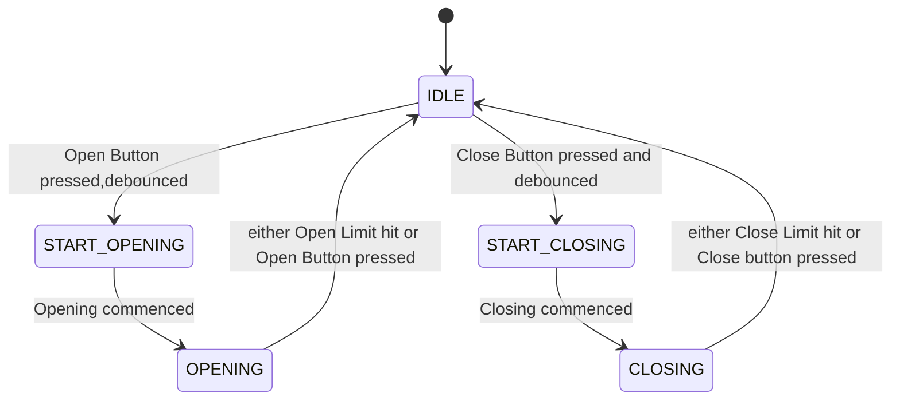
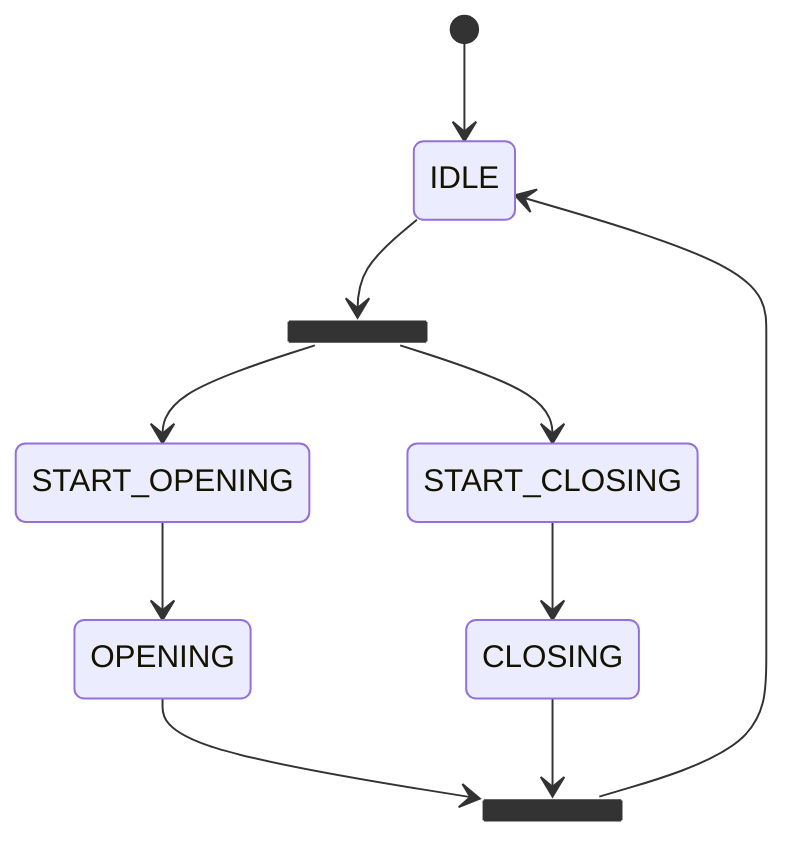

# John's projects

```mermaid
%%===========================================================
%% File: clapper_fsm.mmd
%% Title: Clapper Stepper Motor FSM (RV8824 + LDR)
%%===========================================================

stateDiagram-v2
    [*] --> STATE_IDLE : Power On

    %% --- STATE_IDLE ---
    STATE_IDLE : Waiting for daylight
    STATE_IDLE --> STATE_WAIT_INTERVAL : LDR > threshold → isDay = true

    %% --- STATE_WAIT_INTERVAL ---
    STATE_WAIT_INTERVAL : Waiting interval between moves
    STATE_WAIT_INTERVAL --> STATE_SLEEP : Night detected (isDay = false)
    STATE_WAIT_INTERVAL --> STATE_MOVE : Interval expired → move half-turn
    STATE_WAIT_INTERVAL --> STATE_OVERRIDE : "GO" command received

    %% --- STATE_MOVE ---
    STATE_MOVE : Executing half-turn move
    STATE_MOVE --> STATE_WAIT_INTERVAL : Move complete
    STATE_MOVE --> STATE_OVERRIDE : "GO" command received during move (restarts move)

    %% --- STATE_SLEEP ---
    STATE_SLEEP : Night mode (motor disabled)
    STATE_SLEEP --> STATE_WAIT_INTERVAL : Daylight returns

    %% --- STATE_OVERRIDE ---
    STATE_OVERRIDE : Manual half-turn triggered
    STATE_OVERRIDE --> STATE_MOVE : Begin move

    %% --- Notes ---
    note right of STATE_WAIT_INTERVAL
      • Waits moveInterval (default 30 min)
      • EEPROM-loaded or manually set
      • "SET FREQ <m>" changes interval
      • "SAVE FREQ" stores interval
    end note

    note right of STATE_SLEEP
      • Motor disabled (EN_PIN HIGH)
      • Awaits LDR daylight threshold
    end note

    note left of STATE_MOVE
      • Stepper enabled (EN_PIN LOW)
      • Uses AccelStepper for ramped motion
      • Half-turn (~25s) at low torque
    end note

    note bottom of STATE_OVERRIDE
      • Serial "GO" → immediate half-turn
      • Overrides normal timing
    end note
```

## State machine for curtains





