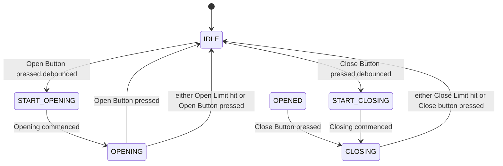

# John's projects

## State machine for curtains

```mermaid
stateDiagram-v2
    direction TB
    [*] --> IDLE
    IDLE --> START_OPENING: Open Button pressed,debounced
    IDLE --> START_CLOSING: Close Button pressed,debounced
    OPENING --> IDLE: Open Button pressed
    CLOSING --> IDLE: either Close Limit hit or Close button pressed
    OPENING --> IDLE: either Open Limit hit or Open Button pressed
    OPENED --> CLOSING: Close Button pressed
START_OPENING --> OPENING: Opening commenced
    
      START_CLOSING --> CLOSING: Closing commenced
  
```
